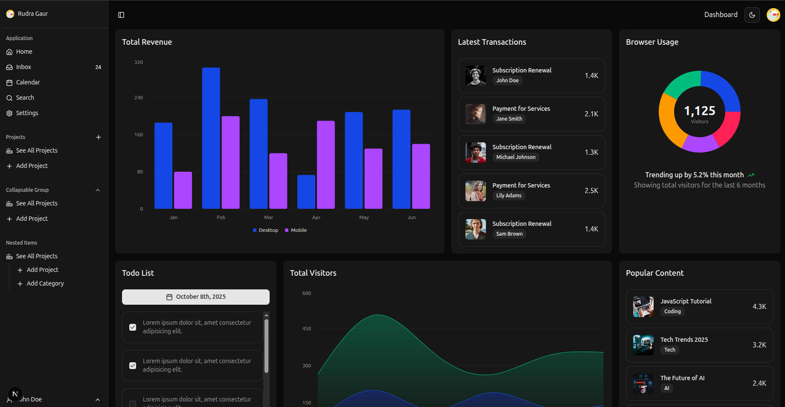

## Shadcn Dashboard

A modern, responsive dashboard built with Next.js 15, React 19, Tailwind CSS 4, and shadcn/ui components. Includes a collapsible sidebar, top navbar, charts, and dark mode.



### Tech Stack
- **Framework**: Next.js 15 (App Router)
- **UI**: React 19, Tailwind CSS 4, shadcn/ui (Radix Primitives)
- **Theming**: next-themes (light/dark/system)
- **Charts**: Recharts
- **Forms**: react-hook-form, zod

### Features
- **Collapsible sidebar** with smooth, GPU-accelerated transitions
- **Top navbar** with theme toggle and menu actions
- **Responsive layout** for desktop and mobile
- **Accessible primitives** powered by Radix
- **Reusable UI components** (buttons, dropdowns, inputs, sheets, tooltips, etc.)

### Getting Started
Prerequisites: Node.js 18+ and npm (or yarn/pnpm/bun)

1) Install dependencies
```bash
npm install
```

2) Start the dev server
```bash
npm run dev
```

Visit `http://localhost:3000` in your browser.

### Available Scripts
```bash
npm run dev     # Start Next.js (with Turbopack)
npm run build   # Production build
npm run start   # Start production server
npm run lint    # Lint project
```

### Project Structure (high level)
- `app/` – App Router entry, pages, and layout
- `components/` – UI and feature components
- `components/ui/` – shadcn-style primitives (Radix-powered)
- `public/` – static assets (e.g., `dashboard.png`)
- `lib/` – utilities

### Styling & Theming
- Tailwind CSS 4 with CSS variables for light/dark themes
- `next-themes` for theme persistence and system preference

### Deployment
- Recommended: Deploy to Vercel for optimal Next.js support
- Build: `npm run build` then `npm run start`

### Credits
- UI primitives and patterns inspired by shadcn/ui and Radix UI
- Icons by lucide-react

### License
This project is provided as-is for educational and personal use. Add your preferred license if you plan to distribute.
